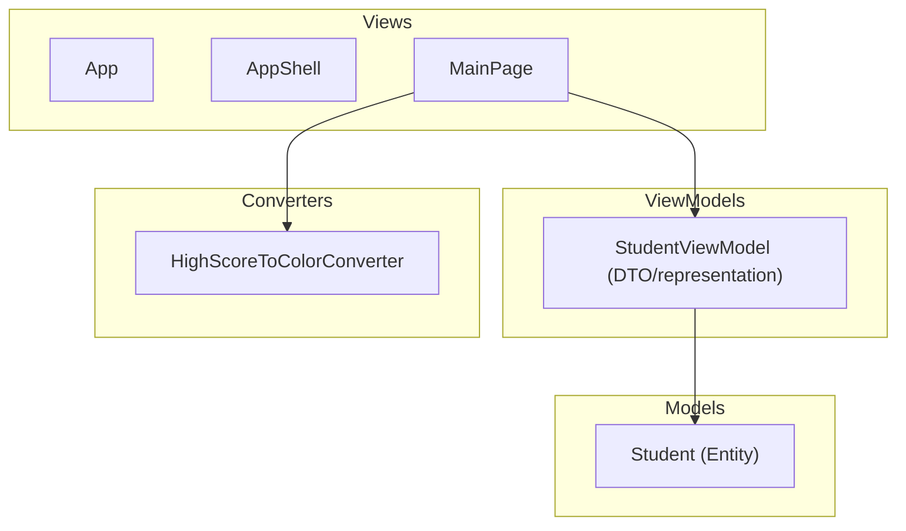

# Mobile_apps_L1_Model_view

## Layers of responsibilities

```mermaid
graph TD
    subgraph Views
        App
        AppShell
        MainPage
    end
    subgraph ViewModels
        StudentViewModel["StudentViewModel (DTO/representation)"]
    end
    subgraph Models
        Student["Student (Entity)"]
    end
    subgraph Converters
        HighScoreToColorConverter
    end
  

    MainPage --> StudentViewModel
    MainPage --> HighScoreToColorConverter
    StudentViewModel --> Student

```
